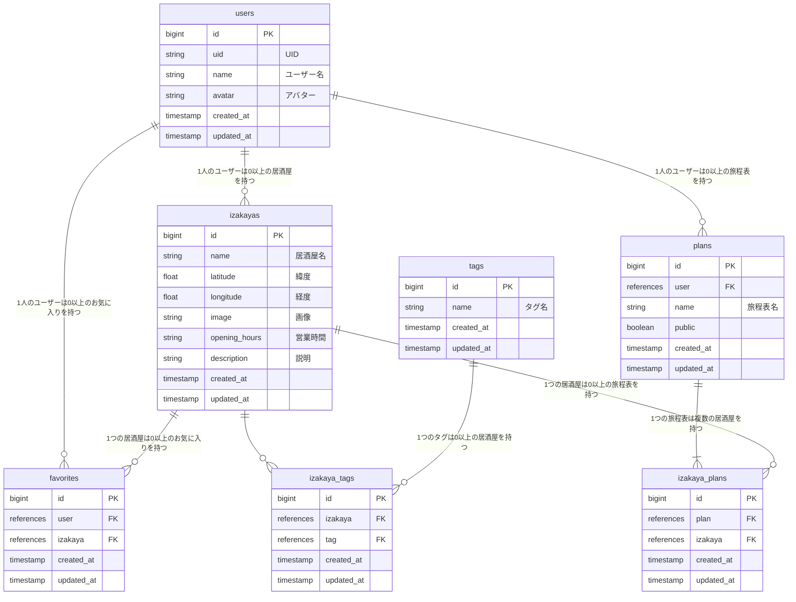

# 西成泥酔旅行（Nishinari Izakaya Crawl）

## サービス概要

西成泥酔旅行（英題：Nishinari Izakaya Crawl）は、大阪市西成区で居酒屋巡りをするためのサービスです。

## このサービスへの思い・作りたい理由

サービス名にある「西成」は、大阪市西成区の「新今宮エリア」を指しています。（参考: [大阪市西成区役所「新今宮ワンダーランド」Web サイト](https://shin-imamiya-osaka.com/)）

私はこのエリアで 8 年前から飲み歩きを始め、100 店舗以上の居酒屋を巡ってきました。

安くておいしい上に、人情味を感じるあたたかい雰囲気のお店がたくさんあり、いわゆる「ハシゴ酒」をするのにぴったりなエリアです。

今までは私自身が友人などを案内し、その魅力を細々と伝えていましたが、私が培った知識を全て落とし込んだサービスを開発し、より多くの人に西成で居酒屋巡りをする楽しさを伝えたいと考えました。

## ユーザー層について

### 西成に訪れる全国の観光客および外国人観光客

かつては西成といえば「治安の悪い街」というイメージが色濃くありましたが、近年は主要観光地へのアクセスの良さから、若者や外国人観光客が多く訪れるスポットになっています。

西成が単なる交通の乗り換え地や宿泊地ではなく、「旅の目的地」になるということをサービスを通して知っていただき、居酒屋巡りを楽しんでほしいと考えています。

## サービスの利用イメージ

ユーザーは PC・スマートフォンでサービスを利用できます。

- 居酒屋を一覧(リスト表示・マップ表示)から店名・タグ等で検索することができます。
- 検索した居酒屋の詳細情報を確認することができます。
- 検索した居酒屋はお気に入りリストに保存することができます。
- お気に入りリストから、居酒屋巡りの旅程表を作成することができます。
- 作成した旅程表は公開・非公開を選択でき、公開した場合は、SNS でシェアできます。

## ユーザーの獲得について

- X（旧 Twitter）を用いた宣伝
- Qiita に技術記事を投稿
- 西成をメインに活動しているインフルエンサー（YouTuber 等）に利用を依頼
- 知人の店舗関係者に利用を依頼

## サービスの差別化ポイント・推しポイント

長年の居酒屋巡りで得た情報を集約し、最新かつ良質な情報を DB 化してユーザーに提供します。

また、店舗で提供される飲食物や設備（例:串カツ、カラオケ）等でのタグ検索を可能にし、ユーザーの趣向に合わせた情報を確度高く取得できます。

さらに、外国人観光客の利用を想定し、言語切り替え機能（英語）を実装します。

## 機能候補

### MVP リリース時

- ユーザー機能（Google アカウントによる認証）
- マップ検索（Google Maps API）
- タグ検索
- 検索結果一覧・詳細ページ
- マイページ
- お気に入りリスト
- 旅程表作成

### 本リリース時

- レスポンシブ対応
- 英語への切り替え対応
- 現在地からのレコメンド
- 現在地から次のお店までのルート検索
- YouTube 動画レコメンド（店舗名で動画を検索）
- 旅程表の共同編集

## 機能の実装方針予定

- フロントエンド: Tailwind CSS (v3.4.3), DaisyUI (v4.11.1), Hotwire
- バックエンド: Ruby (v3.2.3), Ruby on Rails (v7.0.4)
- データベース: PostgreSQL (v16.2)
- 認証: Google OAuth
- インフラ: Docker (v20.10.8), Koyeb
- API: Google Maps API

## 画面遷移図

[こちらをご確認ください（Figma リンク）](https://www.figma.com/design/7HnO9Pu5IqJVVStRWN1Ehm/Nishinari-Izakaya-Crawl?m=dev&node-id=0%3A1&t=D6XPauzNMDk5uAM0-1)

## ER 図

