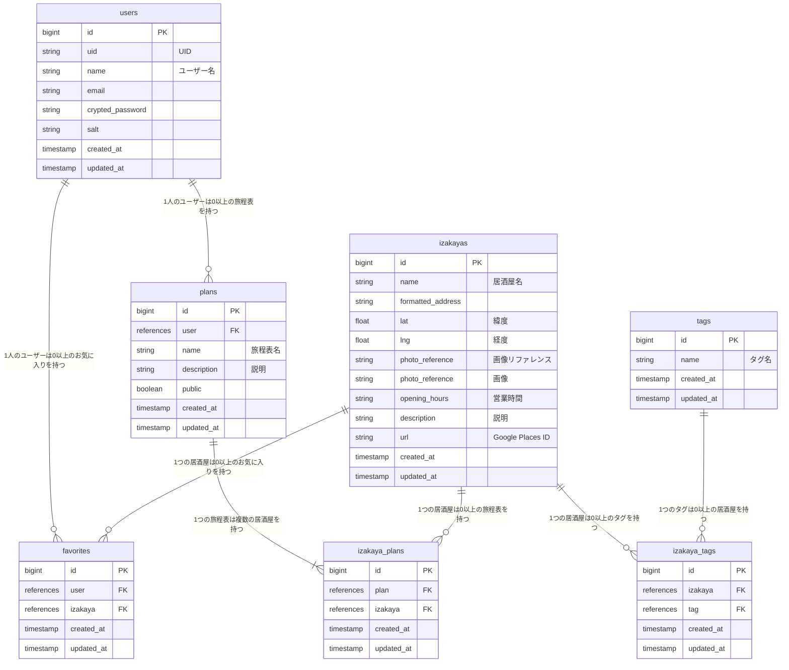

# 西成泥酔旅行（Nishinari Izakaya Crawl）

サービスURL: https://nishinari-izakaya.net

## サービス概要

西成泥酔旅行（英題：Nishinari Izakaya Crawl）は、大阪市西成区で居酒屋巡りをするためのサービスです。

## サービス開発の背景

サービス名にある「西成」は、大阪市西成区の「新今宮エリア」を指しています。（参考: [大阪市西成区役所「新今宮ワンダーランド」Web サイト](https://shin-imamiya-osaka.com/)）

私はこのエリアで 8 年前から飲み歩きを始め、100 店舗以上の居酒屋を巡ってきました。

安くておいしい上に、人情味を感じるあたたかい雰囲気のお店がたくさんあり、いわゆる「ハシゴ酒」をするのにぴったりなエリアです。

今までは私自身が友人などを案内し、その魅力を細々と伝えていましたが、私が培った知識を全て落とし込んだサービスを開発し、より多くの人に西成で居酒屋巡りをする楽しさを伝えたいと考えました。

## ターゲットユーザー

### 西成に訪れる全国の観光客および外国人観光客

かつては西成といえば「治安の悪い街」というイメージが色濃くありましたが、近年は主要観光地へのアクセスの良さから、若者や外国人観光客が多く訪れるスポットになっています。

西成が単なる交通の乗り換え地や宿泊地ではなく、「旅の目的地」になるということをサービスを通して知っていただき、居酒屋巡りを楽しんでほしいと考えています。

## 機能一覧

| 居酒屋検索 |
| :---: |
|  |

ログイン不要で、DBに登録されている珠玉の居酒屋を検索できます。主に居酒屋に紐づくタグで絞り込みを行い、ユーザーのニーズに合った居酒屋を探していただくことを想定しています。タグは複数指定可能です。

 

| マップ検索（Google Maps API） |
| :---: |
|  |

Google Mapから居酒屋を探すことも可能です。また、ユーザーの現在地から近い居酒屋を10件絞り込みする機能を実装しています。

 

| 居酒屋詳細情報 |
| :---: |
|  |

詳細画面では、店名を基にしたYouTube検索に加え、Google Mapへの遷移及び現在地からの行程検索のリンクを配置しています。ユーザーが気になった居酒屋に対してより多くの情報を得ていただけます。

 

| 旅程表の作成 |
| :---: |
|  |

ログインユーザーは飲み歩きの旅程表を作成し、行きたい居酒屋をリストとして登録することができます。登録した居酒屋はドラック&ドロップで行きたい順に並べ替えができます。また、他のユーザーに対して旅程表の公開・非公開を選択でき、公開している旅程表はXでシェアすることができます。

 

| マイページ |
| :---: |
|  |

マイページではユーザーがお気に入り登録した居酒屋と作成した旅程表を確認することができます。

 

| 英語への切り替え |
| :---: |
|  |

外国人観光客にも使っていただけるよう英語ビューに対応しています。

 

## 技術スタック

- フロントエンド: Tailwind CSS (v3.4.3), DaisyUI (v4.11.1), Hotwire
- バックエンド: Ruby (v3.2.3), Ruby on Rails (v7.0.4)
- データベース: PostgreSQL (v16.2)
- 認証: Google OAuth
- インフラ: Docker (v20.10.8), Koyeb
- API: Google Maps API

## 画面遷移図

[こちらをご確認ください（Figma リンク）](https://www.figma.com/design/7HnO9Pu5IqJVVStRWN1Ehm/Nishinari-Izakaya-Crawl?m=dev&node-id=0%3A1&t=D6XPauzNMDk5uAM0-1)

## ER 図

